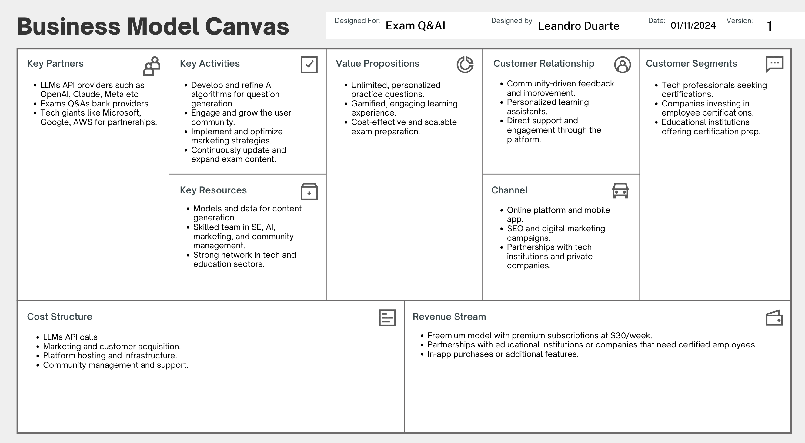

#### Name: Leandro Oliveira Duarte

#### Assignment Context

> This repository serves as the foundation for my Idea Venture Paper assignment in ME2072 Entrepreneurship for Engineers at KTH. The assignment requires developing a business case/plan for an innovative idea, including initial testing through conversations with potential users and stakeholders. While this is primarily a "desktop exercise", the work done here will evolve into practical implementation in the follow-up course ME2073.

> The paper focuses on applying concepts from "Lean Startup" and "Business Model Generation", culminating in a self-assessment. This repository will track the development of the idea and serve as a basis for future entrepreneurial work.

## 1. Summary

*Exam Q&AI* is a modern platform changing how people prepare for exams by using game-like learning and AI to generate questions. It focuses on tech certifications from big companies like Microsoft, Google, and AWS, offering unlimited, personalized practice questions to reduce exam stress and keep users engaged. By using advanced AI, *Exam Q&AI* provides a scalable and affordable solution that helps professionals excel in their certifications and advance their careers.

## 2. Idea Generation

Two years ago, while working as a Data Scientist at BI4ALL, a consultancy for Business Intelligence and Machine Learning, I earned two Microsoft Certifications (DP100 and AI102). These certifications had many short-answer questions, so I needed a lot of practice. I used ExamTopics, which had limited free questions before requiring payment. I was stressed about the exam and didn’t want to pay, so I found ways to access all questions for free. This showed me how addictive exam prep can be and how much pressure there is to pass, especially when your company pays for the exam.

This led me to see a market need for a platform with unlimited practice questions for tech certifications, meeting the high demand for more study resources. My background in education, having founded "CEO - Centro de Explicações Online," Portugal's first fully online tutoring platform, helped this idea grow. The platform expanded quickly in its first year and was bought by 'Portal da Sabedoria,' staying a key player in the Portuguese online tutoring market.

Now, as an AI Engineer at SonantAI, I keep up with the latest in Generative AI text generation. This knowledge, combined with my education experience, inspired *Exam Q&AI*. The goal is to offer endless, engaging, and personalized exam prep, making studying rewarding. Using AI, I can create unlimited questions, make learning fun, and build a strong business model to make *Exam Q&AI* successful.

## 3. Idea Testing

### A) Feedback and Insights

When developing *Exam Q&AI*, I used my network and experience in certification and education to gather insights. Having earned two Microsoft certifications and worked at BI4ALL, a Portuguese consultancy with partners like Google, AWS, and Microsoft, I was around peers who could use such a platform. They shared their exam stress and need for more practice questions.

My colleagues at BI4ALL often used ExamTopics and hit the free question limit, then paid for more access due to the pressure to succeed.

I also spoke with two developers from my alma mater, IST in Lisbon, who worked on a Q&A repository for medical students. They talked about PerguntasQB, a platform for Portuguese medical students, and the high costs of creating quality Q&A content. They mentioned that the company spends a lot on hiring professionals to make more questions since official exam questions aren't enough.

These talks showed there's a real need for cheap, easy-to-scale exam prep tools. The feedback confirmed that using AI to create questions could disrupt traditional Q&A content creation. With AI, *Exam Q&AI* can offer a comprehensive solution, addressing cost and content availability issues.

### B) Interviews

1. **Interview with BI4ALL Peers:**
   - **Participants:** Marta Carreira and Hugo Mendes from the Data Science & AI department.
   - **Method:** Casual talks during lunch and after work.
   - **Key Takeaways:** They felt constantly worried about being under-prepared. They were open to paying for platforms with lots of practice questions, especially if the platform could mimic the exam environment and give instant feedback. Their experience with ExamTopics showed that it's easy to turn users into paying customers, but they still hit question limits and need more specific section questions.

2. **Interview with IST Developers:**
   - **Participants:** Lourenço Ponces and Pedro Henriques, freelance developers working on PerguntasQB.
   - **Method:** In-person meeting in Lisbon.
   - **Key Takeaways:** They highlighted the high cost of creating content and the potential of AI to simplify this process. They liked the idea of using Generative AI and Retrieval-Augmented Generation (RAG) systems to automatically make questions, which could cut costs and increase available practice material.

These discussions made it clear that there's a big need for a cost-effective, scalable exam prep tool. The insights supported using AI to change how Q&A content is created. By automating question generation, *Exam Q&AI* can offer an affordable and thorough solution, solving cost and content issues.

## 4. Idea Pivots

At first, *Exam Q&AI* aimed at standardized tests like the GMAT and GRE. These exams have simple Q&A formats, making them a good starting point. But research showed some problems and opportunities, leading to a pivot.

One main issue was making accurate, high-quality questions for the GMAT and GRE, which need detailed understanding and precise answers. This would require a lot of resources. Also, the market for GMAT and GRE prep is crowded with players like GregMat that offer extensive content at competitive prices, making it hard to stand out. However, research showed that students are willing to pay for practice questions due to exam stress, proving there's demand for a solution that reduces exam anxiety.

Given these challenges, I shifted focus to tech certifications from Microsoft, Google, and AWS. Professionals pursuing these certifications face similar stress but are more willing and able to pay for prep resources. The tech certification market is less crowded than GMAT and GRE, making it easier to differentiate and enter the market. Tech professionals usually have more disposable income and are likely to invest in tools that boost their careers. Workplace pressure to pass certifications also increases the value of thorough prep tools.

As we develop the platform and gather more feedback, we might pivot again, maybe focusing on specific exams or trying different business models to better meet user needs and increase profits. This shift sets *Exam Q&AI* to better serve its target audience, using AI-driven question generation to offer a scalable and affordable tech certification prep solution.

## 5. Innovation

*Exam Q&AI* stands out in the exam prep market through its unique approach to creating content and personalized learning. The key innovation is offering unlimited Q&As for each exam, tailored to each user's needs and preferences. This is done using advanced Generative AI models and Retrieval-Augmented Generation (RAG) techniques to create, solve, and review questions efficiently.

Unlike traditional platforms that rely on manually creating content, *Exam Q&AI* automates this process, cutting costs and saving time. Initially, hired professionals can review the generated content, and the platform plans to use community feedback where users help improve the Q&As. This community-driven model not only improves content accuracy but also creates a collaborative learning environment.

Additionally, the platform uses machine learning to analyze user performance and behavior, providing personalized recommendations on what to focus on. This makes the learning experience more effective. While personalized learning assistants exist, combining this feature with unlimited, dynamically generated content makes *Exam Q&AI* different from competitors.

By combining these elements, *Exam Q&AI* offers a unique value: a scalable, affordable, and highly personalized exam prep experience. This mix of AI-driven content, community engagement, and personalized learning puts *Exam Q&AI* at the leading edge of the exam prep industry, ready to meet the needs of tech professionals and students.

## 6. Problem (or Delight)

*Exam Q&AI* addresses the stress and anxiety of preparing for certification exams, which are important for career growth and job security. Many professionals feel unprepared due to limited practice questions and expensive study materials. The pressure is even higher when employers pay for these exams.

A common issue is starting with free questions on various websites, quickly hitting the limit, and then paying for more access. Even after using almost all available questions, users often feel better prepared in some exam sections than others, leading to ongoing anxiety about weaker areas. *Exam Q&AI* solves this by providing endless tailored questions for the user’s challenging sections, allowing them to focus on weak areas, reducing anxiety, and boosting confidence across the entire exam.

## 7. Market Analysis

The market for tech certifications is growing fast, driven by the demand for skills in cloud computing, data science, and AI. Professionals are pursuing certifications from companies like Microsoft, Google, and AWS to advance their careers. This creates a large pool of potential customers, including IT professionals, data scientists, and engineers eager to move up in their careers. Spending in this area is high, as both individuals and companies invest in exams and prep materials to ensure success.

The tech certification market keeps growing and shows no signs of slowing down. As industries become more digital, the need for certified professionals will continue to rise. Companies see certifications as essential for validating skills and enhancing workforce capabilities.

Key trends include:
- Increased reliance on cloud services and AI, boosting demand for related certifications.
- Certifications becoming the standard for professional development and career growth.
- Shift towards online learning and digital resources making exam prep more accessible.

Challenges include fierce competition among prep platforms, making differentiation crucial, and the fast pace of tech changes requiring constant updates to certification content and prep materials.

Starting with this niche is just the beginning. Our approach can expand to cover various simple Q&A exams across different industries, increasing our reach and impact.

## 8. Value Creation

*Exam Q&AI* provides significant value by tackling key challenges in exam preparation. As mentioned in the Problem section, professionals preparing for tech certifications often face stress and anxiety due to limited practice questions and expensive study materials. The platform solves these issues by offering unlimited, tailored practice questions, allowing users to focus on their weak areas and build confidence in all exam sections.

Our gamified learning experience makes exam prep engaging, boosting user motivation and retention. This not only makes studying more enjoyable but also more effective, as users can concentrate on their weaker areas with personalized recommendations.

The community-driven model encourages collaboration and continuous improvement, creating a supportive environment where users can contribute and benefit from shared insights. This unique combination of features makes *Exam Q&AI* stand out in a competitive market, aligning with users' goals of career advancement and skill validation.

## 9. Founder

As the founder, I am uniquely qualified to launch *Exam Q&AI*. My experience in tech and entrepreneurship has given me the skills, knowledge, and network needed to make this venture successful.

With a strong background in AI and data science, I’ve developed machine learning models and specialized chatbots at BI4ALL, enhancing my technical skills with Python, SQL, and Microsoft Azure. My current role as an AI Engineer at SonantAI, a startup focused on voice bots, has deepened my expertise in Generative AI, which is central to *Exam Q&AI*.

My entrepreneurial spirit is shown through my past ventures. I founded "CEO - Centro de Explicações Online," Portugal's first fully online tutoring platform, which was successfully acquired. This experience taught me how to scale a business quickly and manage a team effectively. Additionally, my role as founder and project manager at Hash Game Store, a Web3 gaming startup, gave me valuable insights into entrepreneurship and startup dynamics, including pitching to investors and navigating competition.

Beyond my technical and entrepreneurial skills, my academic background in Applied Mathematics and my ongoing master’s in Data Science and Entrepreneurship at KTH Stockholm provide the analytical and business skills needed to innovate and execute well. I’ve been a student, educator, and test taker, giving me firsthand understanding of the challenges in certification prep and the industry.

My passion for making education accessible and engaging drives my commitment to *Exam Q&AI*. I’m dedicated to using my skills and experiences to build a platform that meets the needs of tech professionals and sets a new standard in exam preparation. With a strong network in tech and education, I’m well-positioned to lead this venture and create a culture of innovation and excellence.

## 10. Industry

We are targeting the Online Education and Certification Preparation industry. This sector is attractive due to its rapid growth, driven by the increasing demand for tech certifications in areas like cloud computing, data science, and AI. As more professionals seek to validate their skills and advance their careers, the need for effective and accessible exam prep solutions continues to grow.

Several factors affect this industry:
- **Opportunities:** Technological advancements and the adoption of online learning platforms create new chances for innovation and growth. The shift to digital resources makes it easier for platforms like *Exam Q&AI* to reach a global audience and offer scalable solutions.
- **Challenges:** High competition among certification prep platforms means it's important to stand out. The fast pace of technological change requires constant updates to certification content and prep materials to stay relevant.

To succeed, *Exam Q&AI* will use AI-driven content generation to keep costs low and efficiency high. Offering endless, personalized Q&As will attract students, providing a tailored learning experience. The market is large, and with strategic SEO and targeted marketing, we can carve out our niche and gain our first users. Focusing on innovation and user engagement will help us stay ahead, adapting to tech professionals' needs and ensuring our platform remains a top resource in certification prep.

## 11. Rivals

### A) Competitors and Substitutes

1. **ExamTopics**: Offers free exam dumps and practice tests for various IT certifications. It's community-driven, relying on user contributions for content.
2. **MeasureUp**: Provides high-quality certification practice tests with detailed explanations and multiple delivery methods.
3. **GregMat**: Known for affordable GRE prep, offering live classes and comprehensive study materials at a low subscription cost.

### B) Differentiation

*Exam Q&AI* wants to change how exam prep works by being the first to use AI to make unlimited practice questions. Our platform doesn't just offer more questions; it customizes them to address each user's toughest areas, ensuring focused and efficient study. Unlike competitors, we provide a dynamic and engaging Q&A environment that adapts to user-specific challenges, enhancing both learning and retention. With AI-driven content generation, we keep costs low and accuracy high, setting a new standard in exam preparation.

## 12. Pricing

### A) Pricing Strategy

*Exam Q&AI* uses a freemium model like Duolingo, offering basic features for free to attract users and encouraging upgrades to a premium subscription. Our subscription costs $30/week, making it affordable and flexible for users who typically prepare for exams over 2-3 months. This pricing is lower than competitors like ExamTopics, which charges $300/month for limited questions. Unlike ExamTopics, we offer unlimited, personalized practice questions, ensuring users never run out of content.

### B) Evidence of Customer Willingness to Pay

The need for more practice questions is clear from personal experience and peer feedback. Users often use up free resources and are willing to pay for more access. This is supported by platforms like ExamTopics, where users frequently upgrade to paid plans. Our unique offer of unlimited, tailored content makes the $30/week subscription a great option for users looking for an affordable and comprehensive exam prep solution.

## 13. Financial

*Exam Q&AI* is financially promising due to its low initial costs and high scalability. The digital nature of the platform means minimal overhead, and AI-driven content creation reduces expenses. With a freemium model, we can attract many users, converting some to premium subscribers at $30/week. This pricing is competitive, especially compared to platforms like ExamTopics, which charge much more for limited access.

Our strategy relies on strong SEO to capture organic traffic, as most users search online for exam prep resources. This lowers customer acquisition costs and drives growth. A mobile app will increase engagement, making the platform more addictive and encouraging premium upgrades. Targeted YouTube ads will further boost brand awareness and user acquisition.

Assuming the average certification prep time is around 2 months, a user could spend about $250 on the app. While users might stop after their exams, we aim to use word-of-mouth referrals to gain new users. To reduce churn, we plan to expand to different exam types, continuously attracting new users. The year-round nature of these exams ensures a steady flow of potential customers.

Key assumptions include fast user adoption and effective SEO. While the market is competitive, our AI-driven personalization sets us apart. Potential gaps include initial marketing reach, but strategic partnerships with educational institutions could improve distribution. The financial success of similar ventures like ExamTopics and Duolingo shows there's demand and effectiveness for our model. With these strategies, *Exam Q&AI* is set for strong financial performance and market impact.

## 14. Idea Screen Score

- **A. Idea Strength:** 14/20
- **B. Industry:** 18/20
- **C. Market:** 5/20
- **D. Founder:** 19/20
- **E. Financial:** 20/20
- **Overall Score:** 76/100

## 15. Risk

The main risk for *Exam Q&AI* is making sure the AI-generated questions are high-quality and match the exam format. If the algorithms don't produce reliable content, users might lose trust in the platform. To reduce this risk, we will focus on improving our AI-powered application to ensure it generates exam-like questions with accurate solutions.

We'll target early adopters who are open to AI-driven solutions and use their feedback to improve the product. Building a strong community around the platform will be essential. Users can give feedback and verify the quality of the questions, creating a cycle of continuous improvement. This community-driven approach will help build credibility and trust, as users share their success stories and confirm the effectiveness of the Q&As in real exams.

## 16. Business Model Canvas

